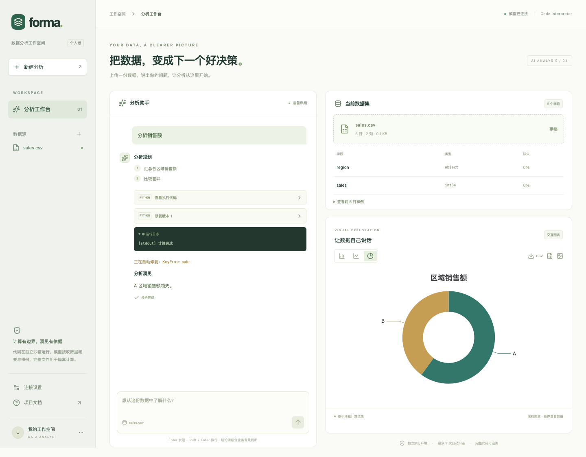
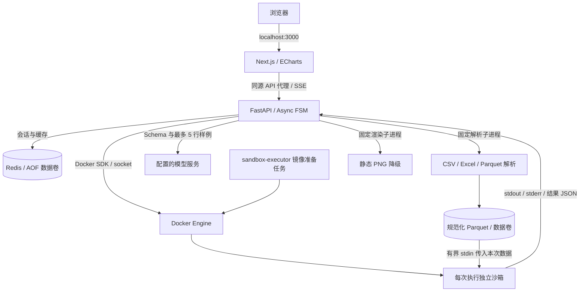
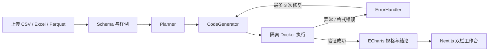

# 自动化数据分析 Agent

上传 CSV / Excel / Parquet，用自然语言提出问题，在同一工作台查看分析规划、Python 代码、执行日志、交互图表与结论。基于 FastAPI、Pydantic v2、Pandas / DuckDB、Redis 和 Next.js 16；生成的代码只在独立 Docker 沙箱中运行。

[一键启动](#一键启动) · [示例与演示](#示例与演示) · [架构](#架构拓扑) · [部署与排错](docs/deployment.md) · [CI 验证](https://github.com/JaYZHOU96916/-Agent/actions/workflows/backend.yml)



截图来自真实前端的 Playwright 测试，接口与模型回复使用固定测试数据；用于展示交互，不代表已接入真实模型或已发布公网 Demo。

## 当前进度

| 阶段 | 状态 |
| --- | --- |
| Phase 0：基础设施、执行沙箱 | 已实现；真实 Docker 验证由 GitHub Actions 执行 |
| Phase 1：文件上传、Schema / 数据概要 | 已实现，包含真实解析接口测试 |
| Phase 2：LLM 状态机、自愈 | 已实现；最多 3 次修复、逐轮错误和代码 Diff |
| Phase 3：SSE、Redis 会话与缓存 | 已实现；类型化事件、实时执行日志、精确与可选语义缓存 |
| Phase 4：Next.js 看板 | 已实现；上传、虚拟字段列表、聊天、图表与导出 |
| Phase 5：示例、部署脚本、完整交付 | 已实现；可复现示例、一键启动、健康探针、部署文档与界面预览 |

当前交付面向本机/单租户，支持可选的共享 API 令牌，但没有用户账户、租户隔离或数据保留策略；不应在公网直接开放。运行环境已升级到 Python 3.14.7、Node.js 26.8.2、TypeScript 7.0.2、Next.js 16.3.5 和 React 19.3.0。Node.js 26 属于 Current 版本，并非 LTS；正式生产部署应按组织的稳定性要求选择并持续维护运行时。Phase 5 完成交付包装，正式上线仍需完成安全隔离和运维验收。

## 一键启动

前置条件：Docker Desktop 或 Docker Engine 已启动，使用 Linux 容器，安装支持 `--wait-timeout` 的 Compose v2。完整工作台不要求宿主机安装 Python、Node.js 或 Redis；生成 CSV 示例另需 Python 3。

```sh
git clone https://github.com/JaYZHOU96916/-Agent.git data-analysis-agent
cd data-analysis-agent
./start.sh
```

脚本首次创建权限为 `600` 的 `.env`，构建并启动四个 Compose 服务，等待前后端就绪，然后从后端检查 Redis、前端 API 代理和一次真实沙箱计算。任何检查失败都会返回非零退出码，不打印启动成功。`sandbox-executor` 是准备沙箱镜像的一次性任务，正常显示 `Exited (0)`；每次分析使用另建的短生命周期容器。

打开 [本地工作台](http://127.0.0.1:3000)。未配置模型时可上传文件、查看数据概要。编辑 `.env` 中的 `LLM_API_KEY`、`LLM_MODEL` 和供应商 `LLM_BASE_URL` 后，再次执行 `./start.sh` 启用分析。脚本保留已有 `.env` 和数据卷，不会主动调用收费模型接口。浏览器连接设置只填写工作台 `API_TOKEN`，不要填写模型密钥。

```sh
docker compose ps -a
docker compose logs --tail=100 backend frontend redis
docker compose down   # 停止服务，保留数据卷
```

配置、持久化、Linux socket 权限与故障定位详见 [部署手册](docs/deployment.md)。

## 示例与演示

```sh
python3 examples/generate.py
# 生成 examples/generated/sales.csv 与 financial_timeseries.csv
```

两份示例均为固定种子的合成数据；脚本拒绝覆盖已有文件。原始数据文件不提交 Git，仓库保留生成代码。安装后端依赖后，可用 `.venv/bin/python examples/generate.py --format all --output examples/generated/all-formats` 同时生成 CSV、XLSX 和 Parquet。

| 示例 | 内容 | 可核对的结果 |
| --- | --- | --- |
| 销售数据 | 2025 年 12 个月、4 地区、3 产品、2 渠道，288 行 / 10 列 | `revenue` 总和为 7,540,350；`marketing_spend` 缺失 17 行 |
| 金融时间序列 | 2025 年所有周一至周五，2 个虚构标的，522 行 / 5 列 | 每个标的 261 条记录；无缺失；不包含交易所节假日规则 |

建议演示顺序：上传 `sales.csv` → 问“按月汇总 revenue 并画趋势图，给出总销售额” → 展开代码和终端日志 → 切换柱/线图并导出 CSV → 原样再问一次以验证精确缓存。再问“按地区比较 revenue，给出贡献占比”，或上传金融示例问“分别计算两个 symbol 的月末 close 并画折线图”。日期字段需要代码显式转换。完整字段说明、核对口径和问题示例见 [示例说明](examples/README.md)。

尚未部署公网 Demo。本地地址在启动后即可交互；远程机器可通过 SSH 端口转发访问，参见部署手册。真实模型效果、耗时与结论以配置后的运行结果为准。

## 架构拓扑



Redis 只连接内部网络，不映射宿主机端口；后端连接内部网络及可访问模型的网络；前后端端口均绑定 `127.0.0.1`。代码沙箱无网络，不挂载 Docker socket 或宿主机目录。模型服务会收到概要、前 5 行样例、问题、计算事实和修复时的报错；选择服务前需确认这些内容可以发送给该供应商。

## 本地启动（Python 3.14+）

```sh
python3.14 -m venv .venv
.venv/bin/python -m pip install -r backend/requirements-dev.txt
PYTHONPATH=backend .venv/bin/python -m uvicorn app.main:app --host 127.0.0.1 --port 8000
```

交互接口文档：[Swagger UI](http://127.0.0.1:8000/docs)。文件解析不依赖 Docker 或 LLM 密钥；运行生成的 Python 代码必须使用 Docker。

## 手动启动与接口

创建本地 `.env`，设置 `LLM_API_KEY` 和 `LLM_MODEL`；可按供应商需要设置 `LLM_BASE_URL`（默认 OpenAI 兼容的 Chat Completions 路径）。不配置密钥时，上传和数据概要仍可使用，分析接口会返回明确的配置提示。模型密钥只保存在后端；前端设置中的 `API_TOKEN` 是工作台访问令牌，不是模型密钥。

```sh
cp .env.example .env
# 编辑 .env：LLM_API_KEY、LLM_MODEL，以及可选的 API_TOKEN
docker compose up --build -d --wait backend frontend
docker compose exec -T backend python - < scripts/verify_stack.py
```

打开 <http://127.0.0.1:3000>。Compose 的 backend Docker SDK 需要访问宿主机 Docker socket；Linux 可在 `.env` 写入 `DOCKER_GID`（Docker socket 的实际组 ID），macOS Docker Desktop 权限请按本机 socket 配置检查。若启用 `API_TOKEN`，在工作台「连接设置」输入该令牌；只保存在页面内存。另可用 `npm --prefix frontend install && npm --prefix frontend run dev` 启动本地前端，并在独立终端启动后端及 Redis。

完整容器联调在 GitHub Actions 中使用固定模型桩、真实 Docker 和 Redis；未提供模型密钥时不会产生真实模型 API 调用。正式上线前应完成真实模型联调、权限策略与保留期配置。

### 分析链路



`POST /api/v1/analyses` 使用 SSE 输出 `plan`、`code`、`stdout`、`chart`、`insight`、`error`、`status`、`done`。失败可修复时保持同一连接，返回每轮的报错、代码和 Diff；超出 3 次修复后返回失败的 `done` 事件。`GET /api/v1/sessions/{session_id}` 返回 Redis 中有时效的事件记录。相同数据集哈希及规范化提问命中精确缓存；可选的语义缓存还要求向量相似度、数字一致及模型确认问题等价。Redis 故障时分析仍继续，但本轮无法持久化会话或缓存。

动态图表为 ECharts Option JSON，校验系列类型/大小及危险属性；支持提示、缩放、柱线饼切换、CSV/JSON 导出。`POST /api/v1/charts/png` 在固定子进程中渲染静态 PNG 作为降级。

```sh
curl -f http://127.0.0.1:8000/healthz
curl -f -F 'file=@/absolute/path/sales.csv' http://127.0.0.1:8000/api/v1/datasets
curl -f http://127.0.0.1:8000/api/v1/datasets/DATASET_UUID
```

`POST /api/v1/datasets` 返回 dataset_id、原始文件 SHA-256、总行列数、列名、推断类型、每列缺失数量/比例、前 5 行预览和解析提示。`GET /api/v1/datasets/{dataset_id}` 可在服务重启后读取同一概要。

支持 UTF-8/BOM CSV、XLSX、XLS、Parquet。Excel 默认只读取第一张工作表，公式仅使用文件中保存的结果，绝不执行公式。CSV 空字段及 Pandas 默认 NA 标记记作缺失值；不自动猜测文本日期。重复/空列名直接拒绝，避免静默改名影响后续代码生成。

## 解析资源与存储

- 默认上传上限 20 MiB、100,000 行、200 列、解码后 DataFrame 上限 128 MiB；超限直接拒绝，不以抽样冒充全量概要。
- ASGI 中间件按实际请求字节计数，支持无 Content-Length 请求；为 multipart 元数据另预留 64 KiB。文件大小另行校验。
- 文件解析在独立、可终止的子进程中进行，默认 30 秒墙钟超时；每个 API 进程最多 2 个解析任务。Linux 额外限制解析进程 2 GiB 虚拟地址空间及 30 秒 CPU，macOS 不保证地址空间限制。此进程只运行固定解析器，不运行 LLM 代码。
- XLSX 展开总大小限制 100 MiB；Parquet 检查元数据中的行数及解码大小。成功结果保存为规范化 Parquet 和 JSON 概要；源文件与失败暂存文件会清理。
- 文件存储在 `DATASET_DIR`（默认 `uploads/`）下，由服务器生成 UUID 目录；上传文件名仅用于展示。整个目录被 Git 忽略。
- 预览单元格字符串最多 256 字符，非有限数值在 JSON 预览中为 null；规范化数据仍保留原始值。
- `build_dataset_context()` 只传 Schema 和最多 5 行样例，默认最多 12,000 字符，截断时明确记录遗漏列数。字符上限不是精确 Token 计数；更大模型/问题仍需按供应商窗口设置。

## Docker 沙箱

```sh
docker compose config --quiet
docker compose up --build backend redis sandbox-executor
```

沙箱按执行请求创建独立容器：禁网、非 root、只读根文件系统、丢弃 Linux capabilities、禁止权限提升、512 MiB 内存且禁用额外 swap、1 CPU、64 PID、默认 10 秒超时。脚本通过 Python 参数执行，FastAPI 进程不使用 `exec` / `eval`。stdout/stderr 分别返回，每路最多保留 256 KiB，并限制 Docker 日志轮转大小。OOM、非零退出与超时返回不同状态。

Compose 的 Docker socket 挂载目前仅是开发配置。后端非 root 用户需要通过 `DOCKER_GID` 与 socket 组权限匹配；`start.sh` 在 Linux 自动读取 socket 组，在 macOS Docker Desktop 使用容器内代理 socket 的组 0，并支持用户目录 socket。远程/rootless Engine 需要另外调整 Compose 的 endpoint、权限和挂载，当前一键脚本不自动配置。Docker socket 持有者拥有很高的宿主机权限；生产环境应使用专用执行节点和受控执行服务。数据集以有界标准输入流传入每次新建的只读容器，仅该容器可访问本次数据。

## 验证

```sh
PYTHONPATH=backend .venv/bin/python -m pytest -q
.venv/bin/ruff check backend examples scripts
bash -n start.sh

# 真实 Docker 测试（需要已启动的 Docker Engine）：
docker build -t data-analysis-sandbox:latest sandbox-runtime
PYTHONPATH=backend RUN_DOCKER_TESTS=1 .venv/bin/python -m pytest backend/tests/test_sandbox_integration.py -q

# 前端构建及浏览器测试：
npm --prefix frontend ci
npm --prefix frontend run build
npm --prefix frontend test
```

未设置 `RUN_DOCKER_TESTS=1` 时明确跳过真实容器测试；全栈联调还需 `RUN_STACK_TESTS=1` 和 Redis。GitHub Actions 使用 Python 3.14 和 Node.js 26，构建镜像并执行真实禁网、只读、超时、OOM、数据传入与自修复联调，同时构建前端和运行 Playwright。交付测试还校验六份示例文件的解析、可复现性、禁止覆盖、启动失败退出码和 `.env` 不被当作 shell 执行。CI 最后实际运行 `./start.sh`，检查四服务启动与后端非 root 用户的 Docker 权限。浏览器测试中的模型答复为测试桩；真实模型需要单独配置密钥验收。

重新生成界面预览：执行前端构建和测试后，检查 `frontend/test-results/workspace-analysis.png`；该产物默认不入 Git，文档使用人工核对后的 `docs/images/workspace-analysis.png`。

此仓库暂未提供 `CLAUDE.md`；提交遵循用户要求：检查测试与忽略规则、明确暂存源文件、Conventional Commit、推送当前分支。请勿提交 `.env`、上传数据、虚拟环境或临时产物。
